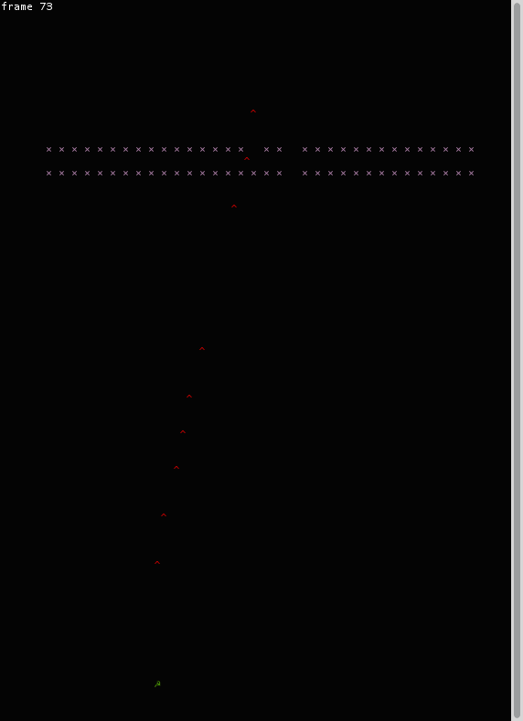

# Camels… IN SPACE!!

This is a tiny game built with [notty](http://pqwy.github.io/notty/)
and my extensive knowledge of how to write games (that is, ∅).

It is a bad clone of space invaders, without sprites, with constant speed,
and a powerful cheatcode known as "play with as high a window as possible".

## Build

You need `containers`, `notty`, and a recent `lwt` (needs `lwt.ppx`).
Just type `make` and you're ready to `./space_camels.native`!

Or use `opam pin`.

## Amazing graphics

